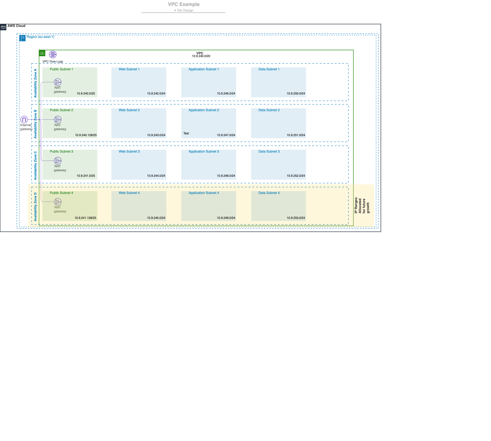

# AWS VPC Terraform Module

> A production-ready, opinionated Terraform module for deploying highly available VPCs on AWS with multi-tier subnet architecture, NAT gateways, VPC Flow Logs, and comprehensive security features.

## Features

- ✅ **Multi-tier subnet architecture** - Up to 4 private subnet tiers plus public subnets
- ✅ **High availability** - Subnets spread across multiple availability zones
- ✅ **Flexible NAT Gateway** - Single NAT or one per AZ with automatic routing
- ✅ **VPC Flow Logs** - Separate logs for accepted and rejected traffic with optional KMS encryption
- ✅ **Security hardened** - Managed default security group, CIDR validation, and VPC endpoints
- ✅ **Kubernetes ready** - Optional EKS/k8s cluster tagging
- ✅ **IPAM support** - Works with AWS VPC IPAM for CIDR management
- ✅ **S3 VPC Endpoint** - Optional Gateway endpoint with custom policies
- ✅ **Infrastructure as Code** - Uses `for_each` for predictable resource management
- ✅ **Cost optimized** - Consolidated public route table reduces AWS costs

## Architecture



### Network Topology

This module creates a multi-tier VPC with the following components:

```
┌─────────────────────────────────────────────────────────────┐
│                          VPC                                 │
│  ┌──────────────────────────────────────────────────────┐  │
│  │  Public Subnets (DMZ)                                │  │
│  │  - Internet Gateway attached                          │  │
│  │  - One route table (shared across all public subnets)│  │
│  │  - NAT Gateway(s) deployed here                      │  │
│  └──────────────────────────────────────────────────────┘  │
│                                                              │
│  ┌──────────────────────────────────────────────────────┐  │
│  │  Private Subnet 01 (Load Balancer tier)             │  │
│  │  - NAT Gateway for internet access                   │  │
│  │  - Separate route table per AZ                       │  │
│  └──────────────────────────────────────────────────────┘  │
│                                                              │
│  ┌──────────────────────────────────────────────────────┐  │
│  │  Private Subnet 02 (Web/App tier)                   │  │
│  │  - NAT Gateway for internet access                   │  │
│  │  - Separate route table per AZ                       │  │
│  └──────────────────────────────────────────────────────┘  │
│                                                              │
│  ┌──────────────────────────────────────────────────────┐  │
│  │  Private Subnet 03 (Application tier)               │  │
│  │  - NAT Gateway for internet access                   │  │
│  │  - Separate route table per AZ                       │  │
│  └──────────────────────────────────────────────────────┘  │
│                                                              │
│  ┌──────────────────────────────────────────────────────┐  │
│  │  Private Subnet 04 (Data tier) - Optional           │  │
│  │  - NAT Gateway for internet access                   │  │
│  │  - Separate route table per AZ                       │  │
│  └──────────────────────────────────────────────────────┘  │
└─────────────────────────────────────────────────────────────┘
```

### Subnet Layout

The module supports a flexible 4-tier private subnet architecture:

| Tier | Default Name | Purpose | Internet Access |
|------|--------------|---------|-----------------|
| **Public** | `dmz` | Internet-facing resources (ALB, NAT Gateway) | Via Internet Gateway |
| **Private 01** | `lb` | Internal load balancers | Via NAT Gateway |
| **Private 02** | `web` | Web/application servers | Via NAT Gateway |
| **Private 03** | `app` | Application services | Via NAT Gateway |
| **Private 04** | `data` | Databases and data stores | Via NAT Gateway |

**Note**: You can deploy 1-4 private tiers by providing CIDR blocks. Empty tiers are not created.

## Usage

### Basic VPC with NAT Gateway

```hcl
module "vpc" {
  source = "path/to/module"

  name               = "production"
  aws_region         = "us-east-1"
  availability_zones = ["us-east-1a", "us-east-1b", "us-east-1c"]

  master_cidr_block = "10.0.0.0/16"

  # Subnets across 3 AZs
  public_cidr_blocks     = ["10.0.0.0/24", "10.0.1.0/24", "10.0.2.0/24"]
  private_cidr_blocks01  = ["10.0.10.0/24", "10.0.11.0/24", "10.0.12.0/24"]
  private_cidr_blocks02  = ["10.0.20.0/24", "10.0.21.0/24", "10.0.22.0/24"]
  private_cidr_blocks03  = ["10.0.30.0/24", "10.0.31.0/24", "10.0.32.0/24"]

  # NAT Gateway configuration
  nat_gateway            = true
  one_nat_gateway_per_az = true

  tags = {
    Environment = "production"
    Terraform   = "true"
  }
}
```

### VPC with S3 Endpoint and Custom Policy

```hcl
module "vpc" {
  source = "path/to/module"

  name              = "secure-vpc"
  master_cidr_block = "10.1.0.0/16"

  public_cidr_blocks    = ["10.1.0.0/24", "10.1.1.0/24"]
  private_cidr_blocks01 = ["10.1.10.0/24", "10.1.11.0/24"]

  # Enable S3 VPC Endpoint
  enable_vpc_s3_endpoint = true
  vpc_s3_endpoint_policy = jsonencode({
    Version = "2012-10-17"
    Statement = [
      {
        Effect    = "Allow"
        Principal = "*"
        Action    = "s3:*"
        Resource  = [
          "arn:aws:s3:::my-bucket/*",
          "arn:aws:s3:::my-bucket"
        ]
      }
    ]
  })
}
```

### VPC with KMS Encrypted Flow Logs

```hcl
module "vpc" {
  source = "path/to/module"

  name              = "compliant-vpc"
  master_cidr_block = "10.2.0.0/16"

  public_cidr_blocks    = ["10.2.0.0/24"]
  private_cidr_blocks01 = ["10.2.10.0/24"]

  # KMS encryption for VPC Flow Logs
  vpcflow_log_kms_key_id         = aws_kms_key.vpc_flow_logs.id
  vpcflow_log_accepted_retention = 30
  vpcflow_log_rejected_retention = 90

  tags = {
    Compliance = "pci-dss"
  }
}
```

### EKS-Ready VPC

```hcl
module "vpc" {
  source = "path/to/module"

  name               = "eks-vpc"
  master_cidr_block  = "10.3.0.0/16"
  availability_zones = ["us-west-2a", "us-west-2b", "us-west-2c"]

  public_cidr_blocks    = ["10.3.0.0/24", "10.3.1.0/24", "10.3.2.0/24"]
  private_cidr_blocks01 = ["10.3.10.0/24", "10.3.11.0/24", "10.3.12.0/24"]

  # EKS requires specific tags
  k8s_clustername = "my-eks-cluster"

  nat_gateway            = true
  one_nat_gateway_per_az = true

  # EKS needs S3 endpoint
  enable_vpc_s3_endpoint = true
}
```

### Cost-Optimized VPC (Single NAT Gateway)

```hcl
module "vpc" {
  source = "path/to/module"

  name              = "dev-vpc"
  master_cidr_block = "10.4.0.0/16"

  public_cidr_blocks    = ["10.4.0.0/24", "10.4.1.0/24"]
  private_cidr_blocks01 = ["10.4.10.0/24", "10.4.11.0/24"]

  # Single NAT Gateway for cost savings (dev/staging)
  nat_gateway        = true
  single_nat_gateway = true

  tags = {
    Environment = "development"
    CostCenter  = "engineering"
  }
}
```

### VPC with IPAM

```hcl
module "vpc" {
  source = "path/to/module"

  name = "ipam-vpc"

  # Use IPAM instead of specifying CIDR
  ipv4_ipam_pool_id   = aws_vpc_ipam_pool.main.id
  ipv4_netmask_length = 24

  # Subnets still need explicit CIDR blocks
  public_cidr_blocks    = ["10.5.0.0/26", "10.5.0.64/26"]
  private_cidr_blocks01 = ["10.5.0.128/26", "10.5.0.192/26"]
}
```

## NAT Gateway Configurations

The module supports three NAT Gateway configurations:

### 1. No NAT Gateway (Default)
```hcl
nat_gateway = false
```
- No internet access for private subnets
- Lowest cost option
- Use for isolated workloads

### 2. Single NAT Gateway
```hcl
nat_gateway        = true
single_nat_gateway = true
```
- One NAT Gateway in the first AZ
- All private subnets route through it
- **Cost savings** for dev/staging environments
- ⚠️ **Single point of failure**

### 3. NAT Gateway per AZ (Recommended for Production)
```hcl
nat_gateway            = true
one_nat_gateway_per_az = true
```
- One NAT Gateway per availability zone
- High availability - no single point of failure
- Higher cost but production-ready
- Each AZ's private subnets use their local NAT Gateway

## Security Features

### VPC Flow Logs
- Automatically enabled for all VPCs
- Separate log groups for accepted and rejected traffic
- Configurable retention periods (default: 14 days)
- Optional KMS encryption for compliance requirements

### Default Security Group
- Managed by Terraform to prevent untracked rules
- Empty by default (no ingress/egress rules)
- Ensures all security groups are explicit

### CIDR Validation
- All CIDR block inputs are validated
- Prevents invalid CIDR blocks at plan time
- Uses Terraform's built-in `cidrhost()` validation

### VPC Endpoint Security
- S3 Gateway endpoint support
- Custom endpoint policies to restrict access
- Reduces data transfer costs and improves security

## Advanced Configuration

### Custom Subnet Naming

```hcl
module "vpc" {
  source = "path/to/module"

  name = "custom-vpc"

  # Custom tier names (appear in Name tags)
  public_tier_name   = "public"
  private01_tier_name = "alb"
  private02_tier_name = "app"
  private03_tier_name = "database"
  private04_tier_name = "backup"
}
```

### Granular Tagging

```hcl
module "vpc" {
  source = "path/to/module"

  name = "tagged-vpc"

  # Global tags applied to all resources
  tags = {
    Environment = "production"
    ManagedBy   = "terraform"
  }

  # Resource-specific tags
  vpc_tags = {
    VPCType = "application"
  }

  public_subnet_tags = {
    SubnetType = "public"
    Monitoring = "enabled"
  }

  private01_subnet_tags = {
    SubnetType = "private-lb"
  }

  nat_gateway_tags = {
    Billing = "networking"
  }
}
```

### Custom DHCP Options

```hcl
module "vpc" {
  source = "path/to/module"

  name = "custom-dhcp-vpc"

  # Custom DNS and NTP servers
  dhcp_domain_name        = "internal.example.com"
  dhcp_domain_name_servers = ["10.0.0.2", "10.0.1.2"]
  dhcp_ntp_servers        = ["169.254.169.123"]

  dhcp_options_tags = {
    DHCPType = "custom"
  }
}
```

## Migration Guide

**⚠️ Version 2.0.0 includes breaking changes!**

If you're upgrading from version 1.x, you **must** run the state migration script to avoid resource recreation.

See [MIGRATION.md](MIGRATION.md) for:
- Complete list of breaking changes
- Step-by-step migration instructions
- Automated state migration script
- Rollback procedures

Key breaking changes:
- Resources now use `for_each` instead of `count`
- VPC and subnet resources renamed
- Public route table consolidated
- Variable types changed for better type safety

## Outputs

The module exports comprehensive outputs for integration with other resources:

```hcl
# Use VPC outputs
resource "aws_security_group" "example" {
  vpc_id = module.vpc.vpc_id
}

# Use subnet outputs
resource "aws_lb" "example" {
  subnets = module.vpc.public_subnet_ids
}

# Use NAT Gateway IPs for firewall rules
resource "aws_security_group_rule" "example" {
  cidr_blocks = module.vpc.nat_gw_eips
}
```

## Best Practices

1. **Always use NAT Gateway per AZ in production** for high availability
2. **Enable S3 VPC Endpoint** to reduce data transfer costs
3. **Use KMS encryption for Flow Logs** in regulated environments
4. **Tag everything** for cost allocation and resource management
5. **Validate CIDR blocks** don't overlap with other VPCs or on-premises networks
6. **Use IPAM** for centralized CIDR management in multi-account setups
7. **Monitor Flow Logs** for security and troubleshooting
8. **Review the migration guide** before upgrading major versions

## Additional Examples

All usage examples are provided inline in this README above. The examples cover:

- ✅ Basic VPC with NAT Gateway
- ✅ VPC with S3 Endpoint and custom policy
- ✅ KMS encrypted VPC Flow Logs
- ✅ EKS-ready VPC configuration
- ✅ Cost-optimized single NAT setup
- ✅ IPAM-based VPC
- ✅ Custom subnet naming
- ✅ Granular tagging
- ✅ Custom DHCP options

## Development

### Tools Required

- [Terraform](https://www.terraform.io/) >= 1.5
- [terraform-docs](https://terraform-docs.io/) - Generate documentation
- [pre-commit](https://pre-commit.com/) - Git hooks for quality checks
- [tfsec](https://github.com/aquasecurity/tfsec) - Security scanning
- [checkov](https://www.checkov.io/) - Policy-as-code scanning

### Testing Changes

```bash
# Format code
terraform fmt -recursive

# Validate syntax
terraform validate

# Generate documentation
terraform-docs markdown table . --output-file README.md --output-mode inject

# Run security scans
tfsec .
checkov -d .

# Run pre-commit hooks
pre-commit run --all-files
```

## Contributing

This module is primarily maintained for personal use, but contributions are welcome:

1. Fork the repository
2. Create a feature branch
3. Make your changes with tests
4. Run pre-commit hooks
5. Submit a pull request

**Note**: While contributions are appreciated, response times may vary and not all features will be accepted.

## Changelog

See [CHANGELOG.md](CHANGELOG.md) for version history and release notes.

## Support

For issues, questions, or feature requests:
- Open an issue on the repository
- Check [MIGRATION.md](MIGRATION.md) for upgrade guidance
- Review existing issues for known problems

<!-- BEGINNING OF PRE-COMMIT-TERRAFORM DOCS HOOK -->
## Requirements

| Name | Version |
|------|---------|
| <a name="requirement_terraform"></a> [terraform](#requirement\_terraform) | >= 1.5 |
| <a name="requirement_aws"></a> [aws](#requirement\_aws) | 6.35.1 |

## Providers

| Name | Version |
|------|---------|
| <a name="provider_aws"></a> [aws](#provider\_aws) | 6.35.1 |

## Modules

No modules.

## Resources

| Name | Type |
|------|------|
| [aws_cloudwatch_log_group.LogGroup-Accept](https://registry.terraform.io/providers/hashicorp/aws/6.35.1/docs/resources/cloudwatch_log_group) | resource |
| [aws_cloudwatch_log_group.LogGroup-Reject](https://registry.terraform.io/providers/hashicorp/aws/6.35.1/docs/resources/cloudwatch_log_group) | resource |
| [aws_default_security_group.default](https://registry.terraform.io/providers/hashicorp/aws/6.35.1/docs/resources/default_security_group) | resource |
| [aws_eip.nat_ip](https://registry.terraform.io/providers/hashicorp/aws/6.35.1/docs/resources/eip) | resource |
| [aws_flow_log.VpcFlowLog-Accept](https://registry.terraform.io/providers/hashicorp/aws/6.35.1/docs/resources/flow_log) | resource |
| [aws_flow_log.VpcFlowLog-Reject](https://registry.terraform.io/providers/hashicorp/aws/6.35.1/docs/resources/flow_log) | resource |
| [aws_iam_policy.vpc_flow_log_cloudwatch](https://registry.terraform.io/providers/hashicorp/aws/6.35.1/docs/resources/iam_policy) | resource |
| [aws_iam_role.vpc_flow_log_cloudwatch](https://registry.terraform.io/providers/hashicorp/aws/6.35.1/docs/resources/iam_role) | resource |
| [aws_iam_role_policy_attachment.vpc_flow_log_cloudwatch](https://registry.terraform.io/providers/hashicorp/aws/6.35.1/docs/resources/iam_role_policy_attachment) | resource |
| [aws_internet_gateway.internet_gw](https://registry.terraform.io/providers/hashicorp/aws/6.35.1/docs/resources/internet_gateway) | resource |
| [aws_nat_gateway.nat_gw](https://registry.terraform.io/providers/hashicorp/aws/6.35.1/docs/resources/nat_gateway) | resource |
| [aws_route.private01_ngw](https://registry.terraform.io/providers/hashicorp/aws/6.35.1/docs/resources/route) | resource |
| [aws_route.private02_ngw](https://registry.terraform.io/providers/hashicorp/aws/6.35.1/docs/resources/route) | resource |
| [aws_route.private03_ngw](https://registry.terraform.io/providers/hashicorp/aws/6.35.1/docs/resources/route) | resource |
| [aws_route.private04_ngw](https://registry.terraform.io/providers/hashicorp/aws/6.35.1/docs/resources/route) | resource |
| [aws_route_table.private01](https://registry.terraform.io/providers/hashicorp/aws/6.35.1/docs/resources/route_table) | resource |
| [aws_route_table.private02](https://registry.terraform.io/providers/hashicorp/aws/6.35.1/docs/resources/route_table) | resource |
| [aws_route_table.private03](https://registry.terraform.io/providers/hashicorp/aws/6.35.1/docs/resources/route_table) | resource |
| [aws_route_table.private04](https://registry.terraform.io/providers/hashicorp/aws/6.35.1/docs/resources/route_table) | resource |
| [aws_route_table.public](https://registry.terraform.io/providers/hashicorp/aws/6.35.1/docs/resources/route_table) | resource |
| [aws_route_table_association.private01](https://registry.terraform.io/providers/hashicorp/aws/6.35.1/docs/resources/route_table_association) | resource |
| [aws_route_table_association.private02](https://registry.terraform.io/providers/hashicorp/aws/6.35.1/docs/resources/route_table_association) | resource |
| [aws_route_table_association.private03](https://registry.terraform.io/providers/hashicorp/aws/6.35.1/docs/resources/route_table_association) | resource |
| [aws_route_table_association.private04](https://registry.terraform.io/providers/hashicorp/aws/6.35.1/docs/resources/route_table_association) | resource |
| [aws_route_table_association.public](https://registry.terraform.io/providers/hashicorp/aws/6.35.1/docs/resources/route_table_association) | resource |
| [aws_subnet.private01](https://registry.terraform.io/providers/hashicorp/aws/6.35.1/docs/resources/subnet) | resource |
| [aws_subnet.private02](https://registry.terraform.io/providers/hashicorp/aws/6.35.1/docs/resources/subnet) | resource |
| [aws_subnet.private03](https://registry.terraform.io/providers/hashicorp/aws/6.35.1/docs/resources/subnet) | resource |
| [aws_subnet.private04](https://registry.terraform.io/providers/hashicorp/aws/6.35.1/docs/resources/subnet) | resource |
| [aws_subnet.public](https://registry.terraform.io/providers/hashicorp/aws/6.35.1/docs/resources/subnet) | resource |
| [aws_vpc.main](https://registry.terraform.io/providers/hashicorp/aws/6.35.1/docs/resources/vpc) | resource |
| [aws_vpc_dhcp_options.dhcp_options](https://registry.terraform.io/providers/hashicorp/aws/6.35.1/docs/resources/vpc_dhcp_options) | resource |
| [aws_vpc_dhcp_options_association.dhcp_options](https://registry.terraform.io/providers/hashicorp/aws/6.35.1/docs/resources/vpc_dhcp_options_association) | resource |
| [aws_vpc_endpoint.s3](https://registry.terraform.io/providers/hashicorp/aws/6.35.1/docs/resources/vpc_endpoint) | resource |
| [aws_vpc_endpoint_route_table_association.private01_s3](https://registry.terraform.io/providers/hashicorp/aws/6.35.1/docs/resources/vpc_endpoint_route_table_association) | resource |
| [aws_vpc_endpoint_route_table_association.private02_s3](https://registry.terraform.io/providers/hashicorp/aws/6.35.1/docs/resources/vpc_endpoint_route_table_association) | resource |
| [aws_vpc_endpoint_route_table_association.private03_s3](https://registry.terraform.io/providers/hashicorp/aws/6.35.1/docs/resources/vpc_endpoint_route_table_association) | resource |
| [aws_vpc_endpoint_route_table_association.private04_s3](https://registry.terraform.io/providers/hashicorp/aws/6.35.1/docs/resources/vpc_endpoint_route_table_association) | resource |
| [aws_vpc_endpoint_route_table_association.public_s3](https://registry.terraform.io/providers/hashicorp/aws/6.35.1/docs/resources/vpc_endpoint_route_table_association) | resource |
| [aws_iam_policy_document.vpc_flow_log_cloudwatch](https://registry.terraform.io/providers/hashicorp/aws/6.35.1/docs/data-sources/iam_policy_document) | data source |
| [aws_iam_policy_document.vpc_flow_logs_assume_role](https://registry.terraform.io/providers/hashicorp/aws/6.35.1/docs/data-sources/iam_policy_document) | data source |

## Inputs

| Name | Description | Type | Default | Required |
|------|-------------|------|---------|:--------:|
| <a name="input_availability_zones"></a> [availability\_zones](#input\_availability\_zones) | AWS region to launch servers. | `list(string)` | <pre>[<br/>  "eu-west-1a",<br/>  "eu-west-1b"<br/>]</pre> | no |
| <a name="input_aws_region"></a> [aws\_region](#input\_aws\_region) | AWS region to launch servers. | `string` | `"eu-west-1"` | no |
| <a name="input_dhcp_domain_name"></a> [dhcp\_domain\_name](#input\_dhcp\_domain\_name) | Enter a domain name (such as example.com). | `string` | `""` | no |
| <a name="input_dhcp_domain_name_servers"></a> [dhcp\_domain\_name\_servers](#input\_dhcp\_domain\_name\_servers) | Enter up to 4 DNS server IP addresses or AmazonProvidedDNS for AWS Defaults | `list(string)` | <pre>[<br/>  "AmazonProvidedDNS"<br/>]</pre> | no |
| <a name="input_dhcp_netbios_name_servers"></a> [dhcp\_netbios\_name\_servers](#input\_dhcp\_netbios\_name\_servers) | Enter up to four NetBIOS name server IP addresses | `list(string)` | `[]` | no |
| <a name="input_dhcp_netbios_node_type"></a> [dhcp\_netbios\_node\_type](#input\_dhcp\_netbios\_node\_type) | Enter the NetBIOS node type, for example, 2 | `string` | `""` | no |
| <a name="input_dhcp_ntp_servers"></a> [dhcp\_ntp\_servers](#input\_dhcp\_ntp\_servers) | Enter up to four Network Time Protocol (NTP) server IP addresses | `list(string)` | `[]` | no |
| <a name="input_dhcp_options_tags"></a> [dhcp\_options\_tags](#input\_dhcp\_options\_tags) | A map of tags to add to DHCP Options. | `map(string)` | `{}` | no |
| <a name="input_enable_vpc_s3_endpoint"></a> [enable\_vpc\_s3\_endpoint](#input\_enable\_vpc\_s3\_endpoint) | Create VPC S3 Endpoint | `bool` | `false` | no |
| <a name="input_ipv4_ipam_pool_id"></a> [ipv4\_ipam\_pool\_id](#input\_ipv4\_ipam\_pool\_id) | Use IPv4 IPAM Pool for VPC | `string` | `""` | no |
| <a name="input_ipv4_netmask_length"></a> [ipv4\_netmask\_length](#input\_ipv4\_netmask\_length) | (Optional) The netmask length of the IPv4 CIDR you want to allocate to this VPC. Requires specifying a ipv4\_ipam\_pool\_id | `number` | `null` | no |
| <a name="input_k8s_clustername"></a> [k8s\_clustername](#input\_k8s\_clustername) | EKS/k8s Cluster Name | `string` | `null` | no |
| <a name="input_master_cidr_block"></a> [master\_cidr\_block](#input\_master\_cidr\_block) | VPC CIDR Block | `string` | `""` | no |
| <a name="input_name"></a> [name](#input\_name) | VPC Name | `string` | `""` | no |
| <a name="input_nat_gateway"></a> [nat\_gateway](#input\_nat\_gateway) | Create NAT Gateway | `bool` | `false` | no |
| <a name="input_nat_gateway_tags"></a> [nat\_gateway\_tags](#input\_nat\_gateway\_tags) | A map of tags to add to NAT Gateway. | `map(string)` | `{}` | no |
| <a name="input_one_nat_gateway_per_az"></a> [one\_nat\_gateway\_per\_az](#input\_one\_nat\_gateway\_per\_az) | Should be true if you want one NAT Gateway per availability zone. | `bool` | `true` | no |
| <a name="input_private01_routing_tables_tags"></a> [private01\_routing\_tables\_tags](#input\_private01\_routing\_tables\_tags) | A map of tags to assign to private01 routing tables. | `map(string)` | `{}` | no |
| <a name="input_private01_subnet_tags"></a> [private01\_subnet\_tags](#input\_private01\_subnet\_tags) | A map of tags to assign to private subnet 01. | `map(string)` | `{}` | no |
| <a name="input_private01_tier_name"></a> [private01\_tier\_name](#input\_private01\_tier\_name) | Tag value for tier subnet | `string` | `"lb"` | no |
| <a name="input_private02_routing_tables_tags"></a> [private02\_routing\_tables\_tags](#input\_private02\_routing\_tables\_tags) | A map of tags to assign to private02 routing tables. | `map(string)` | `{}` | no |
| <a name="input_private02_subnet_tags"></a> [private02\_subnet\_tags](#input\_private02\_subnet\_tags) | A map of tags to assign to private subnet 02. | `map(string)` | `{}` | no |
| <a name="input_private02_tier_name"></a> [private02\_tier\_name](#input\_private02\_tier\_name) | Tag value for tier subnet | `string` | `"web"` | no |
| <a name="input_private03_routing_tables_tags"></a> [private03\_routing\_tables\_tags](#input\_private03\_routing\_tables\_tags) | A map of tags to assign to private03 routing tables. | `map(string)` | `{}` | no |
| <a name="input_private03_subnet_tags"></a> [private03\_subnet\_tags](#input\_private03\_subnet\_tags) | A map of tags to assign to private subnet 03. | `map(string)` | `{}` | no |
| <a name="input_private03_tier_name"></a> [private03\_tier\_name](#input\_private03\_tier\_name) | Tag value for tier subnet | `string` | `"app"` | no |
| <a name="input_private04_routing_tables_tags"></a> [private04\_routing\_tables\_tags](#input\_private04\_routing\_tables\_tags) | A map of tags to assign to private04 routing tables. | `map(string)` | `{}` | no |
| <a name="input_private04_subnet_tags"></a> [private04\_subnet\_tags](#input\_private04\_subnet\_tags) | A map of tags to assign to private subnet 04. | `map(string)` | `{}` | no |
| <a name="input_private04_tier_name"></a> [private04\_tier\_name](#input\_private04\_tier\_name) | Tag value for tier subnet | `string` | `"data"` | no |
| <a name="input_private_cidr_blocks01"></a> [private\_cidr\_blocks01](#input\_private\_cidr\_blocks01) | CIDR Blocks for Private 01 Subnets | `list(string)` | `[]` | no |
| <a name="input_private_cidr_blocks02"></a> [private\_cidr\_blocks02](#input\_private\_cidr\_blocks02) | CIDR Blocks for Private 02 Subnets | `list(string)` | `[]` | no |
| <a name="input_private_cidr_blocks03"></a> [private\_cidr\_blocks03](#input\_private\_cidr\_blocks03) | CIDR Blocks for Private 03 Subnets | `list(string)` | `[]` | no |
| <a name="input_private_cidr_blocks04"></a> [private\_cidr\_blocks04](#input\_private\_cidr\_blocks04) | CIDR Blocks for Private 04 Subnets | `list(string)` | `[]` | no |
| <a name="input_private_routing_tables_tags"></a> [private\_routing\_tables\_tags](#input\_private\_routing\_tables\_tags) | A map of tags to assign to private routing tables. | `map(string)` | `{}` | no |
| <a name="input_private_subnet_tags"></a> [private\_subnet\_tags](#input\_private\_subnet\_tags) | A map of tags to assign to private subnets. | `map(string)` | `{}` | no |
| <a name="input_public_cidr_blocks"></a> [public\_cidr\_blocks](#input\_public\_cidr\_blocks) | CIDR Blocks for Public Subnets | `list(string)` | `[]` | no |
| <a name="input_public_routing_tables_tags"></a> [public\_routing\_tables\_tags](#input\_public\_routing\_tables\_tags) | A map of tags to assign to public routing tables. | `map(string)` | `{}` | no |
| <a name="input_public_subnet_tags"></a> [public\_subnet\_tags](#input\_public\_subnet\_tags) | A map of tags to assign to public subnets. | `map(string)` | `{}` | no |
| <a name="input_public_tier_name"></a> [public\_tier\_name](#input\_public\_tier\_name) | Tag value for tier subnet | `string` | `"dmz"` | no |
| <a name="input_single_nat_gateway"></a> [single\_nat\_gateway](#input\_single\_nat\_gateway) | Should be true if you want to provision for your entire VPC | `bool` | `false` | no |
| <a name="input_tags"></a> [tags](#input\_tags) | A map of tags to add to all resources. | `map(string)` | `{}` | no |
| <a name="input_vpc_enable_dns_hostnames"></a> [vpc\_enable\_dns\_hostnames](#input\_vpc\_enable\_dns\_hostnames) | Enable VPC DNS hostnames | `bool` | `true` | no |
| <a name="input_vpc_enable_dns_support"></a> [vpc\_enable\_dns\_support](#input\_vpc\_enable\_dns\_support) | Enable VPC DNS Support | `bool` | `true` | no |
| <a name="input_vpc_s3_endpoint_policy"></a> [vpc\_s3\_endpoint\_policy](#input\_vpc\_s3\_endpoint\_policy) | A policy to attach to the S3 endpoint that controls access. If not specified, full access is allowed. | `string` | `null` | no |
| <a name="input_vpc_tags"></a> [vpc\_tags](#input\_vpc\_tags) | A map of tags to add to VPC resource. | `map(string)` | `{}` | no |
| <a name="input_vpcflow_log_accepted_retention"></a> [vpcflow\_log\_accepted\_retention](#input\_vpcflow\_log\_accepted\_retention) | How many day's worth of VPC Flow logs to keep for accepted connections | `number` | `14` | no |
| <a name="input_vpcflow_log_kms_key_id"></a> [vpcflow\_log\_kms\_key\_id](#input\_vpcflow\_log\_kms\_key\_id) | KMS key ID for encrypting VPC Flow Logs. If not specified, AWS managed encryption is used. | `string` | `null` | no |
| <a name="input_vpcflow_log_rejected_retention"></a> [vpcflow\_log\_rejected\_retention](#input\_vpcflow\_log\_rejected\_retention) | How many day's worth of VPC Flow logs to keep for rejected connections | `number` | `14` | no |

## Outputs

| Name | Description |
|------|-------------|
| <a name="output_all_subnet_ids"></a> [all\_subnet\_ids](#output\_all\_subnet\_ids) | List all used subnet ids |
| <a name="output_aws_region"></a> [aws\_region](#output\_aws\_region) | AWS Region being used |
| <a name="output_default_security_group_id"></a> [default\_security\_group\_id](#output\_default\_security\_group\_id) | ID of the default security group |
| <a name="output_dhcp_options_id"></a> [dhcp\_options\_id](#output\_dhcp\_options\_id) | ID of the DHCP Options Set |
| <a name="output_internet_gateway_id"></a> [internet\_gateway\_id](#output\_internet\_gateway\_id) | ID of the Internet Gateway |
| <a name="output_nat_gw_eips"></a> [nat\_gw\_eips](#output\_nat\_gw\_eips) | List all NAT Gateway Public IPs |
| <a name="output_private01_routing_table_ids"></a> [private01\_routing\_table\_ids](#output\_private01\_routing\_table\_ids) | Routing table ids for private 01 subnets |
| <a name="output_private01_tier_name"></a> [private01\_tier\_name](#output\_private01\_tier\_name) | Tag being used for describing private subnet 01 tier |
| <a name="output_private02_routing_table_ids"></a> [private02\_routing\_table\_ids](#output\_private02\_routing\_table\_ids) | Routing table ids for private 02 subnets |
| <a name="output_private02_tier_name"></a> [private02\_tier\_name](#output\_private02\_tier\_name) | Tag being used for describing private subnet 02 tier |
| <a name="output_private03_routing_table_ids"></a> [private03\_routing\_table\_ids](#output\_private03\_routing\_table\_ids) | Routing table ids for private 03 subnets |
| <a name="output_private03_tier_name"></a> [private03\_tier\_name](#output\_private03\_tier\_name) | Tag being used for describing private subnet 03 tier |
| <a name="output_private04_routing_table_ids"></a> [private04\_routing\_table\_ids](#output\_private04\_routing\_table\_ids) | Routing table ids for private 04 subnets |
| <a name="output_private04_tier_name"></a> [private04\_tier\_name](#output\_private04\_tier\_name) | Tag being used for describing private subnet 04 tier |
| <a name="output_private_subnet01_ids"></a> [private\_subnet01\_ids](#output\_private\_subnet01\_ids) | List all used private 01 subnet ids |
| <a name="output_private_subnet02_ids"></a> [private\_subnet02\_ids](#output\_private\_subnet02\_ids) | List all used private 02 subnet ids |
| <a name="output_private_subnet03_ids"></a> [private\_subnet03\_ids](#output\_private\_subnet03\_ids) | List all used private 03 subnet ids |
| <a name="output_private_subnet04_ids"></a> [private\_subnet04\_ids](#output\_private\_subnet04\_ids) | List all used private 04 subnet ids |
| <a name="output_private_subnet_ids"></a> [private\_subnet\_ids](#output\_private\_subnet\_ids) | List all used private subnet ids |
| <a name="output_public_routing_table_ids"></a> [public\_routing\_table\_ids](#output\_public\_routing\_table\_ids) | Routing table ids for public subnets |
| <a name="output_public_subnet_ids"></a> [public\_subnet\_ids](#output\_public\_subnet\_ids) | List all used public subnet ids |
| <a name="output_public_tier_name"></a> [public\_tier\_name](#output\_public\_tier\_name) | Tag being used for describing public subnet tier |
| <a name="output_vpc_cidr"></a> [vpc\_cidr](#output\_vpc\_cidr) | CIDR Range being used by VPC |
| <a name="output_vpc_flow_log_accept_cloudwatch_log_group_arn"></a> [vpc\_flow\_log\_accept\_cloudwatch\_log\_group\_arn](#output\_vpc\_flow\_log\_accept\_cloudwatch\_log\_group\_arn) | ARN of the CloudWatch Log Group for accepted VPC Flow Logs |
| <a name="output_vpc_flow_log_accept_id"></a> [vpc\_flow\_log\_accept\_id](#output\_vpc\_flow\_log\_accept\_id) | ID of the VPC Flow Log for accepted traffic |
| <a name="output_vpc_flow_log_reject_cloudwatch_log_group_arn"></a> [vpc\_flow\_log\_reject\_cloudwatch\_log\_group\_arn](#output\_vpc\_flow\_log\_reject\_cloudwatch\_log\_group\_arn) | ARN of the CloudWatch Log Group for rejected VPC Flow Logs |
| <a name="output_vpc_flow_log_reject_id"></a> [vpc\_flow\_log\_reject\_id](#output\_vpc\_flow\_log\_reject\_id) | ID of the VPC Flow Log for rejected traffic |
| <a name="output_vpc_id"></a> [vpc\_id](#output\_vpc\_id) | AWS VPC ID |
| <a name="output_vpc_s3_endpoint_id"></a> [vpc\_s3\_endpoint\_id](#output\_vpc\_s3\_endpoint\_id) | ID of the S3 VPC Endpoint (if enabled) |
<!-- END OF PRE-COMMIT-TERRAFORM DOCS HOOK -->
